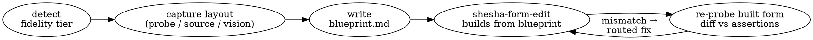

# Shesha Design Comprehension

## Overview

**Core principle: placement is measured, not guessed.** When a form is built from a *prose* description of a design ("a header, then a two-column body, then related panels"), the builder has to re-imagine where every container sits — so columns, nesting depth, tab assignment and grouping drift. This skill removes the guessing: it produces a **layout blueprint** — a hybrid-Markdown intermediate representation that carries the *exact* container tree, flex-row split-child counts, native widths, tab keys and field bindings — and then **verifies the built Shesha form against that blueprint by re-measuring the rendered DOM**. The blueprint is a placement *contract*, and the verification loop enforces it.

This is the layer between "I have a design" and "build the form". It does **not** author form JSON, pick colours, or push — it tells the builder *exactly what to build where*, and checks that it did.

## When to use

- Before building a Shesha form/page from any concrete design (the design source can be readable HTML/JSX source, a runnable prototype/app, or just screenshots/a PDF).
- When a built form "doesn't line up with the design" — wrong columns, panels in the wrong place, a rail that collapsed, tabs merged, fields stacked that should be side-by-side.
- Whenever `shesha-claude-designer` is realising a multi-screen design — it calls this skill once per screen to produce blueprints before delegating the build.

**Do NOT use** to author component structure/CRUD (that is `shesha-form-edit`), to apply colours/theme (that is `shesha-design-system`), or for a form with no design source to match (go straight to `shesha-form-edit` — its default-theme pass keeps the result styled).

## The three things this skill produces

1. A **layout blueprint** per screen — `<workdir>/blueprints/<screen>.blueprint.md`. Format spec + worked example: [references/blueprint-ir.md](references/blueprint-ir.md).
2. A **capture** of the design's real layout — via one of three fidelity tiers (source / runnable / screenshot). How, and where markitdown fits: [references/capture-pipeline.md](references/capture-pipeline.md).
3. A **placement verification** of the built form against the blueprint. Method + the routed-fix loop: [references/verification-loop.md](references/verification-loop.md).

## The pipeline (what to do)

1. **Detect the fidelity tier** of the design source — readable source (A, best), runnable app (B), screenshots/PDF only (C). [capture-pipeline.md](references/capture-pipeline.md).
2. **Capture the layout.** For a runnable design or any rendered page, use the measurement instrument [scripts/layout-probe.js](scripts/layout-probe.js): it walks the DOM at a **pinned viewport** and emits column counts, spans, nesting and row grouping per container. For readable source, parse the grid templates directly. For screenshots/PDF, normalise content with markitdown and read spatial layout from the image.
3. **Write the blueprint** — narrate the captured signal into [blueprint-ir.md](references/blueprint-ir.md) format: a human-reviewable Markdown doc with three fenced machine blocks per region — `layout-tree`, `bindings`, `assertions`.
4. **Hand the blueprint to `shesha-form-edit`** as the build's requirements (archetype + seed selection + column spans + per-field binding). **REQUIRED PARTNER:** `shesha-developer:shesha-form-edit` builds the structure.
5. **Verify by measurement.** Re-probe the built, published, table→details-navigated Shesha form; diff actual placement against the blueprint's `assertions`; route concrete mismatches back to `shesha-form-edit`. [verification-loop.md](references/verification-loop.md).

## How markitdown fits (one layer, not the engine)

markitdown (MCP `convert_to_markdown`, or the CLI) **flattens 2-D layout by design** — it strips CSS, classes, grid columns and positioning, turning a two-column row into two sequential lines. So it is **never** the source of placement. Its real jobs: (a) **source-normalisation** — convert mixed design inputs (a PDF spec, a `.docx`, a domain-model `.md`, a `.pptx`) into a clean content/label/section outline used to *name* fields and cross-check bindings; (b) **screenshot caption** — a prose content outline of an image. Spatial intent always comes from the probe (B), the parsed source grid templates (A), or vision-reading the image (C). Treating markitdown as the layout engine reproduces the exact flattening bug this skill exists to fix.

## Quick reference — the layout probe

| Use | Command |
|---|---|
| Print the browser_evaluate payload (this environment) | `node scripts/layout-probe.js --emit-eval --screen <name>` then pass it to `mcp__playwright__browser_evaluate` |
| Run locally (CI / playwright installed) | `node scripts/layout-probe.js --url <url> --screen <name> --out <file>.json` |
| Read the signal | the `multiColumnContainers` array = split-child count + child widths per container; record widths in native units (px/fr/%) and map each child to a flex-container `desktop.dimensions.width` (calc / % / px) for the blueprint |

Pin **one** viewport (default 1440×900) for *both* capture and verification. Probe output is structural — assert on split-child **membership / grouping / nesting depth / tab key**, never absolute pixels.

## Non-negotiables

- **Measure, don't guess.** Every split-child count / span in a blueprint must come from a probe measurement, a parsed source grid template, or (Tier C only) explicit vision reading — never from prose intuition. Stamp the blueprint with its fidelity tier and confidence.
- **The blueprint is a contract.** Whatever the `assertions` block states MUST be re-verified after the build. A blueprint without verification is just a prettier prose brief.
- **Express splits as flex-container children — NEVER the Shesha `columns` component.** A split is a `container` with `display:"flex"` + `flexDirection:"row"` + `gap` (without an explicit `display:"flex"` the flex props are inert and children stack). Record spans in **native units (px/fr/%)** and map each child to its width lever for the target generation — `desktop.dimensions.width` on 0.45 (fill = `calc(100% - <rail+gap>px)`, rail = fixed px), the `wrapperStyle` fn on 0.43; `customStyle:{flex}` is inert on both. Full sizing physics: `shesha-form-edit/references/renderer-physics.md`. The diff asserts cluster membership / grouping / nesting depth / tab key — never pixels.
- **Stay in your lane.** Produce blueprints + verification verdicts. Never author form JSON, never set colours, never push — route those to `shesha-form-edit` and `shesha-design-system`.
- **One viewport.** Never compare measurements taken at different viewports; record the viewport in every capture.

## Common mistakes

- **Reading markitdown output as layout.** It is reading-order, not placement. Use it for content/labels only.
- **Parsing the compiled/offline single-file bundle.** A minified app bundle yields gibberish — *run* it (Tier B) and probe the rendered DOM, or read the un-minified source (Tier A).
- **Asserting pixels.** Responsive reflow and the pixel↔`calc()`/% width mapping make pixel asserts brittle. Assert membership/grouping/depth/tab.
- **Skipping the re-probe.** If you don't measure the built form, you haven't verified placement — you've only re-described it.

## Relationship to the other skills

| Concern | Skill |
|---|---|
| Ingest design, plan screens, orchestrate, verify end-to-end | `shesha-developer:shesha-claude-designer` (calls this skill per screen) |
| **Comprehend a design → measured layout blueprint + placement verification** | **this skill** |
| Build correct structure, CRUD, validate, push | `shesha-developer:shesha-form-edit` |
| Map tokens → app theme + per-component v7 style blocks | `shesha-developer:shesha-design-system` |
